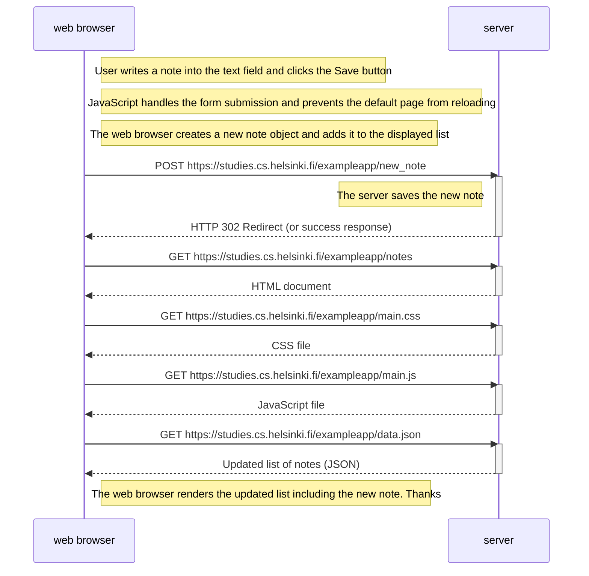

```mermaid
sequenceDiagram
    participant web browser
    participant server

    Note right of web browser: User writes a note into the text field and clicks the Save button

    Note right of web browser: JavaScript handles the form submission and prevents the default page from reloading

    Note right of web browser: The web browser creates a new note object and adds it to the displayed list

    web browser->>server: POST https://studies.cs.helsinki.fi/exampleapp/new_note
    activate server
    Note left of server: The server saves the new note
    server-->>web browser: HTTP 302 Redirect (or success response)
    deactivate server

    web browser->>server: GET https://studies.cs.helsinki.fi/exampleapp/notes
    activate server
    server-->>web browser: HTML document
    deactivate server

    web browser->>server: GET https://studies.cs.helsinki.fi/exampleapp/main.css
    activate server
    server-->>web browser: CSS file
    deactivate server

    web browser->>server: GET https://studies.cs.helsinki.fi/exampleapp/main.js
    activate server
    server-->>web browser: JavaScript file
    deactivate server

    web browser->>server: GET https://studies.cs.helsinki.fi/exampleapp/data.json
    activate server
    server-->>web browser: Updated list of notes (JSON)
    deactivate server

    Note right of web browser: The web browser renders the updated list including the new note. Thanks
```